# ⚡ Catalyst Lens — Autonomous Multi-Agent Product Intelligence Platform

<div align="center">

[](https://nextjs.org/)
[](https://react.dev/)
[](https://ai.google.dev/)
[](https://www.typescriptlang.org/)
[](https://catalyst-console-kappa.vercel.app)
[](LICENSE)

**Autonomous AI Cognitive Workflow for Industrial Distributors & B2B E-Commerce**  
*Transforms raw, ambiguous manufacturer part numbers into structured, verified, 252-column enterprise commerce catalog intelligence.*

[🌐 Live Production Demo](https://catalyst-console-kappa.vercel.app) • [📖 Architecture](#-system-architecture) • [🚀 Quickstart](#-quickstart-guide) • [📋 252 Schema Dictionary](#-252-delivery-schema-specification)

</div>

---

## 📌 Executive Summary

Industrial distributors manage millions of complex SKUs across diverse domains (Pneumatics, Electrical, Plumbing, Flow Control, Power Transmission). Raw distributor data feeds are notoriously incomplete:
- Cryptic, unsearchable part numbers (e.g. `DBD090094101F`)
- Ambiguous or truncated descriptions without standard taxonomy
- Missing attribute values, inconsistent units of measure (UOM), and absent specification sheets
- Zero source traceability for regulatory compliance

**Catalyst Lens** is an autonomous multi-agent product intelligence platform that ingests raw product seeds, technical PDF specification sheets, and engineering drawings to synthesize **100% compliant 252-column commerce catalogs** with full evidence traceability, List of Values (LOV) normalization, and automated confidence scoring.

---

## 🏛️ System Architecture

```mermaid
flowchart TD
    subgraph Ingestion ["1. Multimodal Ingestion Layer"]
        A1["Raw Seed String\n(MPN / Brand / Raw Desc)"]
        A2["Technical PDF Datasheets\n(Spec Sheets / Catalogs)"]
        A3["Engineering Drawings & Photos\n(CAD / Nameplate / Diagrams)"]
        A4["1,000-SKU Batch Datasets\n(Excel / CSV Distributor Feeds)"]
    end

    Ingestion --> Orchestrator["🧠 Agentic Cognitive Orchestrator"]

    subgraph MultiAgentEngine ["2. Multi-Agent Pipeline (Sequential Execution)"]
        direction TB
        
        Agent1["🔍 1. Web Research Agent\n• Google Search Grounding via Gemini 2.5 Flash\n• Real-time Manufacturer Entity Resolution\n• Verifiable Source Retrieval & Attribution"]
        
        Agent2["📄 2. Document + Vision Agent\n• Multimodal PDF & Image OCR Analysis\n• Engineering Diagram & Dimensional Spec Parsing\n• Tolerances, Voltage, Pressure & UOM Extraction"]
        
        Agent3["⚡ 3. RAG Catalog Agent\n• 3-Tier Taxonomy Classification (Dept > Class > Fine)\n• 5 Multi-Channel Description Synthesis\n• 252 Static Commerce Header Generation"]
        
        Agent4["🛡️ 4. Validation & Guardrails Agent\n• Controlled List of Values (LOV) Enforcement\n• Measurement Unit Normalization & Formatting\n• Hallucination Bounds & Quality Confidence Scoring"]

        Agent1 --> Agent2
        Agent2 --> Agent3
        Agent3 --> Agent4
    end

    Orchestrator --> MultiAgentEngine

    subgraph Deliverables ["3. Enterprise Output & Presentation"]
        D1["📊 Unified 252 Delivery Headers"]
        D2["🔍 Slide-Over Product Inspector with Evidence Citations"]
        D3["🎯 Single-Product Focus & Table Isolation View"]
        D4["📥 One-Click Export: Formatted Excel (.xlsx) & CSV"]
    end

    Agent4 --> Deliverables
```



---

## ✨ Core Platform Capabilities

### 1. 📐 Strict 252-Column Delivery Schema Alignment
The platform enforces zero schema drift against standard commerce delivery requirements:
- **5 Multi-Channel Description Standards**:
  - `SHORT_DESC`: Concise, high-relevance search title (**≤120 characters**).
  - `MOBILE_DESC`: Structured mobile app layout (**≤80 characters**).
  - `INVOICE_DESC`: Standardized uppercase ERP invoice descriptor (**≤40 characters**).
  - `LONG_DESC1`: In-depth commercial product specification for web product detail pages.
  - `RETAIL_DESC` & `MARKETING_DESCRIPTION`: Customer-facing promotional copy.
- **50 Standardized Attribute Triplets**: Up to 50 individual attributes formatted as `ATTRIBUTE_LABEL n`, `ATTRIBUTE_VALUE n`, and `ATTRIBUTE_UOM n`.
- **20 Item Features**: Key operational selling points (`ITEM_FEATURES_1..20`).
- **Traceable Digital Assets**: Canonical `Product Image`, `Specification Sheet`, `MFR URL`, `Warranty`, and `Prop 65` compliance flags.

### 2. 📄 Autonomous Multimodal PDF & Image Ingestion
- Attach **any PDF datasheet** or **product/diagram image** with all form fields left blank.
- The **Document + Vision Agent** inspects the document via Gemini Multimodal Vision, extracts the Part Number, Manufacturer, Brand, dimensional ratings, voltage/pressure tolerances, and features, and triggers full catalog synthesis autonomously.

### 3. 🎯 Single-Product Focus & Table Isolation View
- Click any product row or preset pill to isolate the table to **only that selected product**.
- Instant slide-over **Inspector Drawer** displays all 252 populated headers, 3-tier taxonomy breadcrumbs, normalized LOV attributes, and source evidence citations.
- Restore the full 1,000-catalog view anytime with a single click.

### 4. 📦 1,000-Item Batch Processing Engine
- High-throughput asynchronous enrichment pipeline for processing entire distributor catalogs.
- Real-time streaming progress indicators with active SKU logging and speed metrics.
- Export entire catalog results to **CSV** or multi-sheet **Excel (`.xlsx`)**.

---

## 📋 252 Delivery Schema Specification

| Column Group | Delivery Headers | Description & Rules |
| :--- | :--- | :--- |
| **Product Identifiers** | `PART_NUMBER`, `Mfg_Part_Num`, `MANUFACTURER_PART_NUMBER`, `Part_Desc` | Canonical SKU resolution & distributor cross-reference. |
| **Brand & Manufacturer** | `BRAND_NAME`, `MANUFACTURER_NAME` | Normalized brand and corporate parent entities. |
| **3-Tier Taxonomy** | `Dept`, `Class`, `Fine`, `Classpath` | Standardized category hierarchy (e.g. `Industrial Supplies>Valves>Industrial Valves`). |
| **Product Names** | `Product Name`, `MARKETING_DESCRIPTION` | Standardized commerce title and marketing summary. |
| **Multi-Channel Descriptions** | `SHORT_DESC`, `MOBILE_DESC`, `INVOICE_DESC`, `LONG_DESC1`, `RETAIL_DESC` | Multi-channel formatted descriptors tailored for web, mobile, and ERP. |
| **Digital Assets & Policies** | `MFR URL`, `Product Image`, `Specification Sheet`, `Actual Image (Yes/No)`, `Warranty`, `Prop 65`, `Selling Qty`, `Selling UOM` | Verified asset filenames, manufacturer URLs, packaging units, and safety flags. |
| **Product Features** | `ITEM_FEATURES_1` through `ITEM_FEATURES_20` | Extracted product capabilities and operational highlights. |
| **Product Attributes** | `ATTRIBUTE_LABEL 1..50`, `ATTRIBUTE_VALUE 1..50`, `ATTRIBUTE_UOM 1..50` | Standardized attribute triplets with normalized units of measure. |

---

## 🚀 Quickstart Guide

### Prerequisites
- **Node.js**: `v20.x` or `v22.x`
- **Package Manager**: `pnpm` (recommended), `npm`, or `yarn`
- **Google Gemini API Key**: (Optional for built-in sample presets; required for arbitrary product discovery and document vision)

### 1. Clone & Install
```bash
# Clone repository
git clone https://github.com/Vedag812/catalyst-lens.git

# Navigate into project directory
cd catalyst-lens

# Install dependencies
pnpm install
```

### 2. Configure Environment
Create a `.env.local` file in the root directory:
```env
GEMINI_API_KEY=your_google_gemini_api_key_here
```
*(Note: `.env.local` is strictly ignored by `.gitignore` to prevent leaking API credentials).*

### 3. Start Development Server
```bash
pnpm dev
```
Open [http://localhost:3000](http://localhost:3000) in your browser.

### 4. Build for Production
```bash
pnpm build
pnpm start
```

---

## 🧪 Sample Test Inputs

Test the live pipeline with these diverse industrial products:

| Domain | Part Number | Description / Seed | Expected Output |
| :--- | :--- | :--- | :--- |
| **Flow Control** | `77F14801` | `2 INCH 316SS 3-PC FULL PORT BALL VALVE 1000 WOG FNPT` | Classpath: `Industrial Supplies>Valves>Industrial Valves`<br>Attributes: Size `2 in`, Material `316 Stainless Steel`, Rating `1000 psi` |
| **Automation** | `CDQ2B50-30DZ` | `SMC COMPACT CYLINDER DBL ACT SGL ROD 50MM BORE 30MM STROKE` | Classpath: `Pneumatics>Cylinders>Compact Cylinders`<br>Attributes: Bore `50 mm`, Stroke `30 mm`, Action `Double Acting` |
| **Electrical** | `QO3100` | `SCHNEIDER SQUARE D QO MINIATURE CIRCUIT BREAKER 100A 3P 240V` | Classpath: `Electrical>Circuit Breakers>Miniature Breakers`<br>Attributes: Current `100 A`, Poles `3`, Voltage `240 V` |
| **Power Tools** | `2804-20` | `MILWAUKEE M18 FUEL 1/2 IN BRUSHLESS HAMMER DRILL DRIVER` | Classpath: `Tools>Power Tools>Drills & Drivers`<br>Attributes: Chuck Size `1/2 in`, Torque `1200 in-lb`, Voltage `18 V` |
| **Hydraulics** | `4306-8-8` | `PARKER FEMALE JIC SWIVEL HOSE FITTING 1/2 IN HOSE STEEL 4000 PSI` | Classpath: `Hydraulics>Fittings>Hose Fittings`<br>Attributes: Hose ID `1/2 in`, Pressure `4000 psi`, Material `Steel` |

---

## 🔌 API Reference

### `POST /api/enrich`
Streaming serverless edge route that executes the 4-agent intelligence pipeline and streams live NDJSON execution events.

#### Request Body
```json
{
  "seed": {
    "part": "77F14801",
    "description": "2 INCH 316SS 3-PC FULL PORT BALL VALVE 1000 WOG FNPT",
    "brand": "Apollo Valves",
    "manufacturer": "Conbraco Industries Inc"
  },
  "headers": ["PART_NUMBER", "Mfg_Part_Num", "Product Name", "...252 headers"],
  "files": [
    {
      "name": "datasheet.pdf",
      "type": "application/pdf",
      "size": 102400,
      "data": "JVBERi0xLjQK..."
    }
  ]
}
```

#### Streaming Response (NDJSON)
```json
{"type":"agent","index":0,"state":"working","agent":"Web Research Agent","message":"Querying catalog databases with Google Search Grounding..."}
{"type":"agent","index":0,"state":"done","agent":"Web Research Agent","message":"✓ Retrieved 1 grounded sources across distributor networks"}
{"type":"agent","index":1,"state":"working","agent":"Document + Vision Agent","message":"Multimodal analyzing attached document..."}
{"type":"agent","index":1,"state":"done","agent":"Document + Vision Agent","message":"✓ Extracted part '77F14801' & 9 technical specs"}
{"type":"agent","index":2,"state":"working","agent":"RAG Catalog Agent","message":"Synthesizing evidence into 252 static commerce schema headers..."}
{"type":"agent","index":2,"state":"done","agent":"RAG Catalog Agent","message":"✓ Populated 252 commerce headers"}
{"type":"agent","index":3,"state":"working","agent":"Validation Agent","message":"Validating 252 schema constraints and UOM normalization..."}
{"type":"agent","index":3,"state":"done","agent":"Validation Agent","message":"✓ 100% schema compliant (Confidence score: 96%)"}
{"type":"result","result":{"output":{"PART_NUMBER":"77F14801","...":"..."},"claims":[],"score":96,"approved":true}}
```

---

## 🌐 Deployment to Vercel

The application is pre-configured for instant zero-configuration deployment on Vercel:

```bash
# Authenticate CLI
vercel login

# Deploy preview
vercel

# Deploy to production
vercel --prod
```

### Configure Environment Variables on Vercel:
1. Open your project on the [Vercel Dashboard](https://vercel.com/dashboard).
2. Go to **Settings > Environment Variables**.
3. Add `GEMINI_API_KEY` (applied to Production, Preview, and Development).
4. Redeploy.

---

## 🔒 Security & Quality Assurance

- **Zero Credential Exposure**: `.env.local` and all API keys are strictly excluded from git tracking.
- **Graceful Quota Resilience**: The pipeline includes intelligent fallback parsing to handle rate limits seamlessly without crashing or interrupting active batch operations.
- **Strict Evidence Grounding**: Every generated specification is audited and assigned a confidence score backed by source evidence citations.

---

## 📄 License

This project is licensed under the **MIT License** — see the [LICENSE](LICENSE) file for details.
