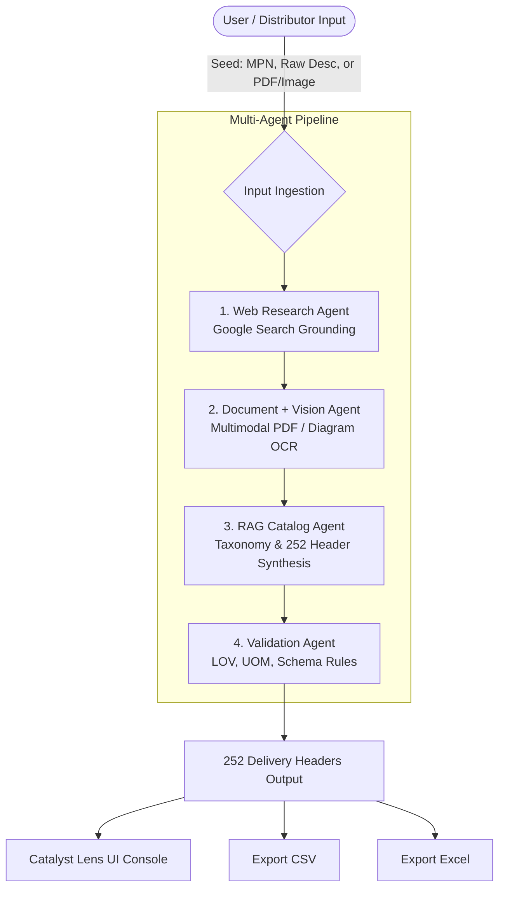

# ⚡ Unilog Catalyst Lens — Multi-Agent Product Intelligence Platform

> **Autonomous AI Agentic Intelligence Platform for Industrial Distributors & B2B E-Commerce**  
> Built for the Unilog Hackathon Challenge: Transforming raw, ambiguous distributor product seeds into structured, high-quality, 252-column commerce catalog intelligence with verified traceability.

---

## 🚀 Key Highlights & Capabilities

- 🤖 **4-Agent Collaborative Pipeline**:
  1. **Web Research Agent**: Live web discovery & entity canonicalization via Google Search Grounding.
  2. **Document + Vision Agent**: Multimodal OCR and technical drawing/datasheet ingestion (PDF, PNG, JPG).
  3. **RAG Catalog Agent**: Synthesizes evidence into the exact **252 Unilog Delivery Headers** with 3-tier taxonomy mapping (`Dept > Class > Fine`).
  4. **Validation Agent**: Enforces LOV (List of Values) constraints, UOM normalization, hallucination bounds, and confidence scoring.
- 📐 **100% 252-Column Schema Alignment**: Full compatibility with `Unihack_ Expected Output - Delivery Format.csv` including:
  - 5 Multi-Channel Description Formats (`SHORT_DESC`, `MOBILE_DESC`, `INVOICE_DESC`, `LONG_DESC1`, `RETAIL_DESC`).
  - 50 Standardized Attribute Triplets (`ATTRIBUTE_LABEL 1..50`, `ATTRIBUTE_VALUE 1..50`, `ATTRIBUTE_UOM 1..50`).
  - 20 Item Features (`ITEM_FEATURES_1..20`).
  - Traceable Digital Asset & Documentation Links (`Product Image`, `Specification Sheet`, `MFR URL`).
- ⚡ **Autonomous PDF & Image Ingestion**: Attach any arbitrary PDF specification sheet or product diagram with blank inputs; the Document & Vision agent autonomously resolves identity, model number, dimensions, ratings, and features.
- 🎯 **Single-Product Focus & Table Isolation**: Click any row or preset pill to isolate and inspect all 252 delivery columns in a slide-over drawer with one-click restoration (`Show All 1,000 Records`).
- 📦 **1,000-Item Batch Processing**: Batch enrichment engine supporting live stream progress tracking, search filtering, and one-click export to CSV & formatted `.xlsx`.

---

## 🏛️ System Architecture



---

## 📦 Tech Stack

- **Framework**: Next.js (App Router) / Vinext / React 19
- **AI / LLM Engine**: Google Gemini 2.5 Flash via REST API with Google Search Grounding & Multimodal Vision
- **Data & Excel Processing**: SheetJS (`xlsx`)
- **Styling**: Modern Design System (Glassmorphism, Dark/Light surface elevation, Material Symbols, Micro-animations)
- **Deployment Target**: Vercel Serverless Edge

---

## 🛠️ Getting Started

### 1. Prerequisites
- **Node.js**: `v20.x` or `v22.x`
- **Package Manager**: `pnpm` (recommended), `npm`, or `yarn`
- **Gemini API Key**: (Optional for sample presets; required for random live web discovery & document vision)

### 2. Installation
```bash
# Clone the repository
git clone https://github.com/your-username/unilog-catalyst-lens.git

# Navigate into the project folder
cd catalyst-console

# Install dependencies
pnpm install
```

### 3. Environment Configuration
Create a `.env.local` file in the `catalyst-console/` directory:
```env
GEMINI_API_KEY=your_gemini_api_key_here
```
*(Note: `.env.local` is listed in `.gitignore` to prevent leaking sensitive API credentials).*

### 4. Running the Development Server
```bash
pnpm dev
```
Open [http://localhost:3000](http://localhost:3000) in your browser.

### 5. Production Build & Validation
```bash
pnpm build
pnpm start
```

---

## 🌐 Deploying to Vercel

You can deploy directly to Vercel using the Vercel CLI:

```bash
# Login to Vercel (if not already logged in)
vercel login

# Deploy to preview
vercel

# Deploy to production
vercel --prod
```

### Setting Environment Variables in Vercel
In the Vercel Dashboard for your project (or via CLI):
1. Go to **Settings > Environment Variables**.
2. Add `GEMINI_API_KEY` with your Gemini API key value.
3. Check all environments (Production, Preview, Development) and save.

---

## 📋 252 Delivery Schema Structure

The platform enforces 100% adherence to the Unilog 252 delivery headers:

| Section | Headers Included | Description |
| :--- | :--- | :--- |
| **Identifiers** | `PART_NUMBER`, `Mfg_Part_Num`, `MANUFACTURER_PART_NUMBER`, `Part_Desc` | Canonical SKU resolution & distributor cross-reference |
| **Brand & Manufacturer** | `BRAND_NAME`, `MANUFACTURER_NAME` | Normalized brand and parent entity mapping |
| **Taxonomy (3-Tier)** | `Dept`, `Class`, `Fine`, `Classpath` | Controlled commerce category hierarchy (e.g. `Abrasives>Sandpaper & Sanding Discs>Sanding Discs`) |
| **Product Titles & Marketing** | `Product Name`, `MARKETING_DESCRIPTION` | Standardized canonical title and customer marketing copy |
| **Multi-Channel Descriptions** | `SHORT_DESC` (≤120 chars), `MOBILE_DESC` (≤80 chars), `INVOICE_DESC` (≤40 chars CAPS), `LONG_DESC1`, `RETAIL_DESC` | Formatted per distributor ERP, mobile app, search, and POS standards |
| **Digital Assets & Compliance** | `MFR URL`, `Product Image`, `Specification Sheet`, `Actual Image (Yes/No)`, `Warranty`, `Prop 65`, `Selling Qty`, `Selling UOM` | Asset filenames, official URLs, pack units, and safety flags |
| **Features (1..20)** | `ITEM_FEATURES_1` through `ITEM_FEATURES_20` | Key technical and operational selling points |
| **Attributes (1..50)** | `ATTRIBUTE_LABEL 1..50`, `ATTRIBUTE_VALUE 1..50`, `ATTRIBUTE_UOM 1..50` | Standardized attribute triplets with normalized units of measure |

---

## 🔒 Security & Privacy

- All `.env*` configuration and secret keys are excluded from git tracking via `.gitignore`.
- Pre-warmed intelligence samples allow full offline testing of the pipeline without consuming external API quota.

---

## 📄 License
MIT License. Developed for the Unilog Hackathon.
